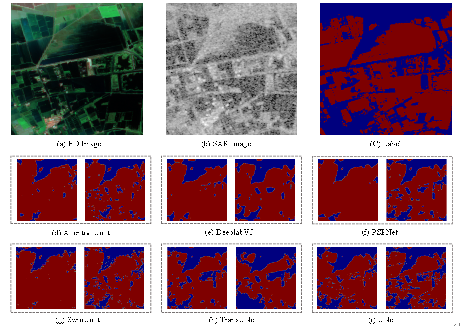

# Distillation-Water-Body-Detection

This research introduces the Efficient Water Body Detection Based on Knowledge Distillation for SAR Imagery, a novel knowledge distillation-based framework that significantly enhances water body detection accuracy in SAR satellite imagery while maintaining computational efficiency.

# Sentinel-2 data Download link:
https://github.com/cloudtostreet/Sen1Floods11

# code 
The source code will be available for download.

# Result

Detection Result Samples from the Spain Site. Visualization includes (a) SAR Image, (b) EO Image, (c) Label, and (d)-(f) comparative results of AttentiveUnet, DeeplabV3, PSPNet, SwinUnet, TransUNet, and UNet models before(left) and after(right) integrating proposed distillation learning methodology.

# Email:
B23160008@s.upc.edu.cn